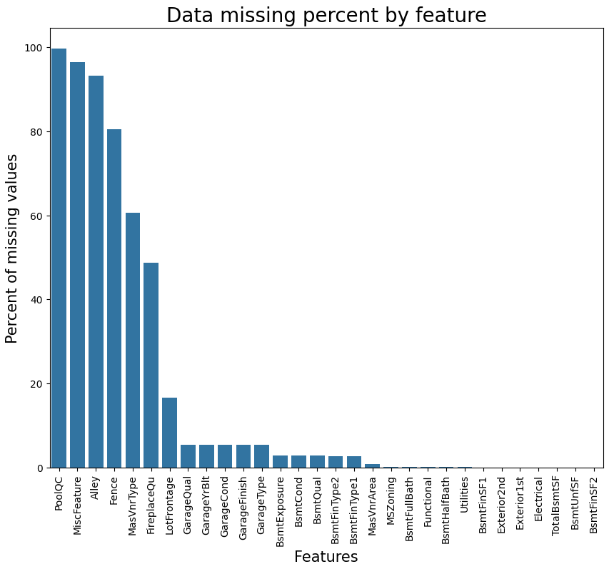
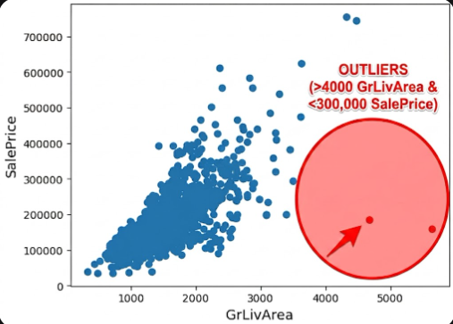
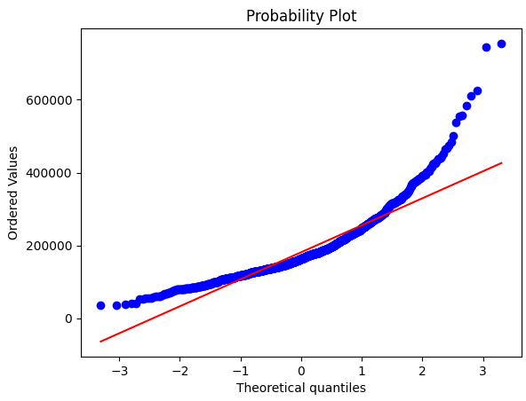
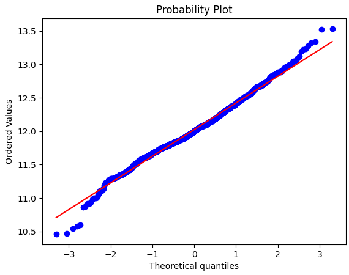
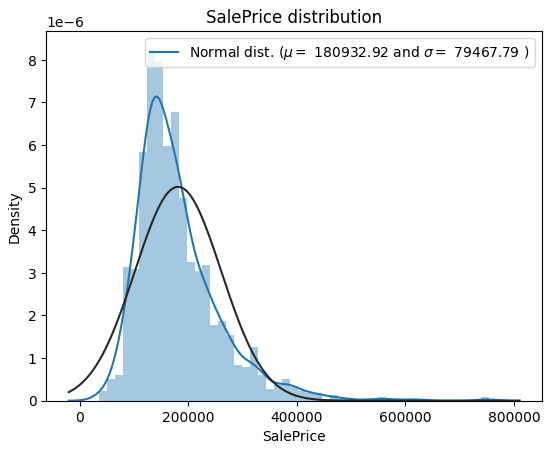
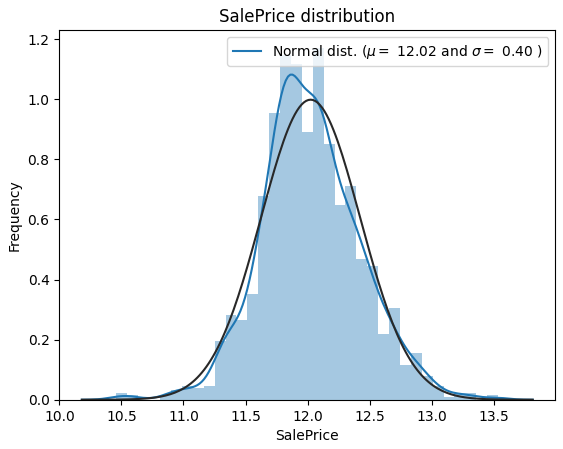
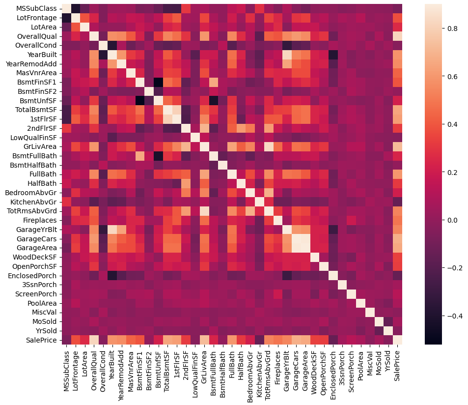
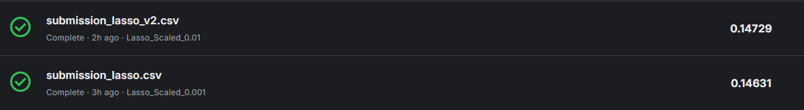
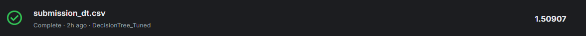
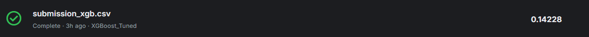

# 🏠 House Prices - Advanced Regression Techniques

## 📌 კონკურსის მიმოხილვა

Kaggle House Prices კონკურსის მიზანია საცხოვრებელი სახლების საბოლოო გაყიდვის ფასის (SalePrice) პროგნოზირება სხვადასხვა მონაცემზე დაყრდნობით, ანუ ეს არის რეგრესიის ამოცანა.

## 🧠 ჩემი მიდგომა

მონაცემების გაწმენდის შემდეგ, ჩავატარე სხვადასხვა preprocessing ნაბიჯები (NA-ების შევსება, კატეგორიული ცვლადების კოდირება, სვეტების მოცილება), Feature Engineering და ავაგე რამდენიმე მოდელი, საუკეთესო შედეგისთვის გამოვიყენე XGBoost მოდელი.

## 📁 რეპოზიტორიის სტრუქტურა

```
ML-Assignment1/
├── model_experiment.ipynb    ← მოდელის ექსპერიმენტების ნოუთბუქი
├── model_inference.ipynb     ← საბოლოო მოდელის გამოყენება პროგნოზისთვის
├── README.md                 ← პროექტის აღმწერი ფაილი
├── data/
│   ├── train.csv             ← ტრეინინგ მონაცემები
│   ├── test.csv              ← ტესტ მონაცემები
│   └── data_description.txt  ← მონაცემების აღწერა
├── submissions/              ← სხვადასხვა მოდელების submission ფაილები
│   ├── submission.csv
│   ├── submission_dt.csv
│   ├── submission_final.csv
│   ├── submission_lasso.csv
│   ├── submission_lasso_v2.csv
│   ├── submission_rf.csv
│   └── submission_xgb.csv
└── mlruns/                   ← MLflow ექსპერიმენტების ლოგები
```

## 📄 ფაილების აღწერა

- **model_experiment.ipynb**: ძირითადი ნოუთბუქი მოდელის კვლევისთვის, სადაც ხდება მონაცემების დამუშავება, feature engineering, feature selection და სხვადასხვა მოდელების ტრეინინგი MLflow-ზე დალოგვით.
- **model_inference.ipynb**: ნოუთბუქი საბოლოო მოდელის გამოსაყენებლად, სადაც ხდება ტესტ მონაცემების დამუშავება და პროგნოზის გენერაცია.
- **data/train.csv**: სამუშაო მონაცემები.
- **data/test.csv**: ტესტ მონაცემები.
- **data/data_description.txt**: მონაცემების სვეტების აღწერა.
- **submissions/**: სხვადასხვა მოდელების მიერ გენერირებული submission ფაილები Kaggle-ზე ასატვირთად.
- **mlruns/**: MLflow-ის მიერ შექმნილი დირექტორია ექსპერიმენტების ლოგებისთვის.

## 🧼 Cleaning

### ➤ Nan მნიშვნელობების შევსება

გამოვიყენე სხვადასხვა სტრატეგიები NA მნიშვნელობების შესავსებად:


Categorical (None): ისეთი სვეტები, სადაც NaN ნიშნავს ობიექტის არარსებობას (მაგ. PoolQC, GarageType), შევავსე "None"-ით.

Categorical (Mode): ისეთი სვეტები, სადაც მნიშვნელობა აუცილებლად უნდა ყოფილიყო (მაგ. MSZoning), შევავსე მოდის მნიშვნელობით.

Numerical (Zero): ფართობისა და რაოდენობის აღმნიშვნელ სვეტებში (მაგ. MasVnrArea) გამოვიყენე 0.

LotFrontage: შევავსე არა ზოგადი, არამედ სამეზობლოების მიხედვით აღებული მედიანის მნიშვნელობით, რადგან სამეზობლოს მედიანური ფასი უფრო რეალური აღმწერი იქნებოდა სახლის ფასისთვის, ვიდრე ზოგადად ყველა სახლის მედიანური ფასი .



### ➤ Outliers-ების მოცილება

მოვაცილე outliers სახლები, სადაც GrLivArea > 4000 და SalePrice < 300000, რადგან noisy მონაცემები იყო და მოდელების დატრენინგებას ხელს უშლიდა. 



### ➤ Target Transformation



Saleprice-ს გრაფიკის დაკვირვებისას აშკარად იყო, რომ წრფივი დამოკიდებულება არ იყო მათ შორის და გაჭირდებოდა მათი წრფივი მოდელებით ამოხსნა, მაგრამ განაწილების ფორმა ახლოს იყო ექსპონენციალის გრაფიკთან, ამიტომ log(1+x) მოვდე Saleprice მონაცემებს და ისე ვიმუშავე.



ასევე, Saleprice-ის განაწილება იყო ასიმეტრიული, იყო საკმაოდ გადახრილი ნორმალური განაწილებისგან. 



მაგრამ ლოგარითმის მოდებამ ეს განაწილებაც "გაანორმალურა".




## 🧬 Feature Engineering

### ➤ ახალი სვეტების შექმნა

- **TotalSF**: TotalBsmtSF + 1stFlrSF + 2ndFlrSF - სახლის საერთო ფართობი.

### ➤ კატეგორიული ცვლადების კოდირება

გამოვიყენე LabelEncoder ორდინალური კატეგორიული სვეტებისთვის, სადაც არსებობდა იერარქია (მაგ. ExterQual: Po, Fa, TA, Gd, Ex).

შემდეგ გამოვიყენე pd.get_dummies() ყველა დანარჩენი კატეგორიული სვეტისთვის One-Hot Encoding-ისთვის.

## 🧪 Feature Selection

გამოვიყენე კორელაციის ფილტრი SalePrice-თან. შევარჩიე სვეტები, სადაც აბსოლუტური კორელაცია მეტი იყო 0.1 - ზე. ანუ მოვიშორე ისეთი სვეტები, რომლებიც 0.1 ზე ნაკლებად იყვნენ დაკავშირებული SalePrice-თან.
ამან შეამცირა სვეტების რაოდენობა დაახლოებით 200-დან 100-მდე, თუმცა ზოგ ალგორითმში მაინც სრული სვეტების რაოდენობა გამოვიყენე.

ამ ნახატზე კი მოცემულია სვეტების ერთმანეთთან კორელაციის კვადრატი:


## 🧪 Training

### ტესტირებული მოდელები

1. **Linear Regression**: ჩვეულებრივი წრფივი რეგრესია. 
1. **Lasso Regression**: რეგულარიზაციით წრფივი რეგრესია. გამოვიყენე alpha=0.001 და 0.01.
2. **Kernel Ridge**: Kernel-ებით გაფართოებული Ridge. გამოვიყენე poly kernel degree=2.
3. **Decision Tree Regressor**: ხის basic მოდელი. გამოვიყენე GridSearchCV max_depth და min_samples_split-ისთვის.
4. **Random Forest Regressor**: Ensemble ხის მოდელი. გამოვიყენე GridSearchCV n_estimators, max_depth და სხვებისთვის.
5. **XGBoost Regressor**: Gradient Boosting მოდელი. გამოვიყენე ოპტიმიზებული პარამეტრები.

(მოდელების საქმიანობას ქვემოთ, ექსპერიმენტების ბმულებთან ვხსნი)

### Hyperparameter ოპტიმიზაციის მიდგომა

 ზოგი მოდელის ჰიპერპარამეტრებს ხელით ვცვლიდი ისე, რომ overfit-ში ან underfit ში არ წასულიყო, ზოგ მოდელში GridSearchCV გამოვიყენე, რათა მეპოვა საუკეთესო ჰიპერპარამეტრები. GridSearchCV-ს მეტი დრო კი მიჰქონდა, რადგან თითოეულ ვარიანტზე უწევდა მოდელს განხილვა, მაგრამ საუკეთესო შედეგის მისაღებად მაინც ღირდა. GridSearchCV გამოვიყენე ამ მოდელებისთვის:

- Decision Tree: max_depth, min_samples_split, min_samples_leaf
- Random Forest: n_estimators, max_depth, min_samples_split, min_samples_leaf
- XGBoost: n_estimators, max_depth, learning_rate, subsample

### საბოლოო მოდელის შერჩევის დასაბუთება

ამასაც ქვემოთ ავხსნი, რადგან მოდელებს ქვემოთ განვიხილავ.


### MLflow ექსპერიმენტების ბმული

- [Assignment1-House_Prices ექსპერიმენტი](https://dagshub.com/Sula1909/ML-Assignment1.mlflow)

📈 Linear Regression

საწყისი Linear Regression, რომელსაც ლოგარითმიც კი არ ქონდა მოდებული და შესაბამისად ყველაზე საშინელი და ყველაფერს აცდენილი შედეგები დააბრუნა. https://dagshub.com/Sula1909/ML-Assignment1.mlflow/#/experiments/1/runs/6bfd6b37986e4af29d91a399ebe20557

რადგან ლოგარითმის მოდების შემდეგ SalePrice-ს ფუნქციამ დაახლოებით წრფივი ფორმა მიიღო, შემეძლო მეფიქრა, რომ წრფივი მოდელით ნორმალურ პასუხამდე გასვლა. ამის გამო გამოვიყენე შედარებით უფრო დახვეწილი, მაგრამ მაინც პრიმიტიული Linear Regression. აქ უკვე მოდებულია ლოგარითმი და ადამიანური პასუხი აქვს დაბრუნებული, მაგრამ სხვა მოდელებს მაინც ჩამორჩება შედეგითაც და კომპლექსურობითაც. https://dagshub.com/Sula1909/ML-Assignment1.mlflow/#/experiments/1/runs/a46ed802ef3c431fb4e198ae68cd6e55

📈 Lasso

შემდეგ Lasso-ს მოდელები სხვადასხვა alpha-თი. რაც უფრო ნაკლებია alpha, მით უფრო მეტ feature-ს იყენებს, ანუ მეტია სიზუსტეც (train-ზე).
Lasso 0.1 https://dagshub.com/Sula1909/ML-Assignment1.mlflow/#/experiments/1/runs/c961faebbdd14c4484fd62d7f63e78ac
Lasso 0.01 https://dagshub.com/Sula1909/ML-Assignment1.mlflow/#/experiments/1/runs/0ce7b6d86994497cad6c8e580a72a586
Lasso 0.001 https://dagshub.com/Sula1909/ML-Assignment1.mlflow/#/experiments/1/runs/16867cbcc9204c7ba3877f0720e9097d

Lasso 0.01-ს და 0.001-ს R2-ებს შორის train-ზე საკმაო სხვაობა იყო, 0.02 (Lasso 0.001-ს სასარგებლოდ) და RMSE-ებს შორისაც 0.015, მაგრამ test-ზე თითქმის იდენტური RMSE  შედეგები აჩვენეს, Lasso 0.01 - მა 0.14729 და Lasso 0.001 - მა 0.14631. ანუ Lasso 0.001 ნელ-ნელა overfit-სკენ მიდიოდა და ამ მონაცემების სირთულისთვის არ იყო საჭირო 0.001 საჭირო, რადგან უკვე გაზეპირებისკენ მიდიოდა. 


💎 Kernel Ridge Regression

შემდეგ Kernel Ridge მოდელი გამოვიყენე. თავიდან დაუსკალირებელ დატაზე დავტესტე, რამაც, რა თქმა უნდა, საშინელი შედეგი მომცა. https://dagshub.com/Sula1909/ML-Assignment1.mlflow/#/experiments/1/runs/82c8ba05d6dc498ea035fb26a583ead6

მაგრამ ამის შემდეგ დასკალირებულ დატაზე დავტესტე ჰიპერპარამეტრებით (alpha=1.0, kernel='poly', degree=2) და train-ზე ყველა მოდელს შორის საუკეთესო შედეგი მომცა როგორც R2-ში, ასევე RMSE და MAE-ში. https://dagshub.com/Sula1909/ML-Assignment1.mlflow/#/experiments/1/runs/4eca1a7f5cd540d7852a00ba6cf44b14
ამის გამო ვიფიქრე, რომ საუკეთესო მოდელს მივაგენი, მაგრამ შემდეგ test-ზე გაშვებისას საკმაო სხვაობა იყო train და test შედეგებს შორის და აღმოვაჩინე, რომ overfit-სკენ მიდიოდა მოდელი. train-ზე RMSE ჰქონდა 0.11, ხოლო test-ზე 0.15. ასე რომ უკეთეს მოდელზე დავიწყე ფიქრი.


🌲 Decision Tree

ამის შემდეგ უკვე ხეებზეც გადავედი და პირველი, რა თქმა უნდა, პრიმიტიული Decision Tree მოდელი ვცადე, რომელმაც train-ზე სხვებთან შედარებით საკმაოდ უარესი, მაგრამ მაინც ნორმალური შედეგი დააბრუნა. მაგრამ test-ზე გაშვების შემდეგ მივხვდი, რომ საშინელ overfit თან მქონდა საქმე, რადგან submission ფაილში ნაწინასწარმეტყველები ყველა ID-ის შესაფერისი SalePrice იყო კონკრეტული რიცხვი, 705 766$ და Kaggle-ზეც, რა თქმა უნდა საშინელი შედეგი აჩვენა. https://dagshub.com/Sula1909/ML-Assignment1.mlflow/#/experiments/1/runs/3cc8e1677dd44563abb77725ab35263a

არადა Decision Tree-ს ჰიპერპარამეტრებისთვის GridSearchCV გამოვიყენე და საუკეთესო პარამეტრებად {'max_depth': 10, 'min_samples_leaf': 2, 'min_samples_split': 10} დააბრუნა, მაგრამ როგორც უკვე ვთქვი, Decision Tree-ს მოღვაწეობა სრული კრახით დასრულდა და ამ ამოცანისთვის ზედმეტად პრიმიტიული იყო.


🌳 Random Forest

Decision Tree-ს შემდეგ უკვე ვცადე Random Forest, რომელიც Decision Tree-ების ერთიანობაა და დაახლოებით იმავე პრობლემას ველოდი და ასეც მოხდა.
DT-სგან განსხვავებით train-ზე კარგი შედეგები დააბრუნა Random Forest-მა https://dagshub.com/Sula1909/ML-Assignment1.mlflow/#/experiments/1/runs/47b9a53611164a769836e17db4c02466
იმის მიუხედავად, რომ Random Forest-ის საუკეთესო პარამეტრების საპოვნელად აქაც GridSearchCV გამოვიყენე და დრო დავხარჯე, test-ზე გაშვებისას სრული კრახი განიცადა მოდელმა და სერიოზული overfit გამოავლინა, SalePrice-ს output-ებიც ერთმანეთთან საკმაოდ ახლო-მახლო რიცხვები იყო. ანუ დასკვნა ის იყო, რომ DT თუ ზედმეტად პრიმიტიული იყო ამ ამოცანისთვის, DT-ების ერთიანობაც პრიმიტიული იქნებოდა. 


🚀 XGBoost

და შემდეგ უკვე მივადექი XGBoost-ს, რომელიც თავიდან საკმაოდ basic პარამეტრებით გამოვიყენე max_depth, n_estimators da random_state, მაგრამ შედეგი მაინც კარგი მივიღე https://dagshub.com/Sula1909/ML-Assignment1.mlflow/#/experiments/1/runs/1b9fa9273ab54bae957ba6588cf214c6

ამის შემდეგ კი ისევ GridSearchCV გამოვიყენე, რომელმაც ტრადიციულად მეტი დრო წაიღო, მაგრამ დააბრუნა ჰიპერპარამეტრები {'learning_rate': 0.05, 'max_depth': 6, 'n_estimators': 300, 'subsample': 0.8} და ამ ვერსიამ train-ზე საუკეთესო მეტრიკები აჩვენა XGBoost-ის პასუხებში და მითუმეტეს ჩემი გამოყენებული ხეების მოდელების პასუხებში. https://dagshub.com/Sula1909/ML-Assignment1.mlflow/#/experiments/1/runs/83185705b07842e99e196e7d780a154c
test-ზე RMSE 0.14228, ხოლო train-ზე - 0.13921.

### საბოლოო მოდელის შერჩევის დასაბუთება

**XGBoost_Tuned** მოდელმა test-ზე აჩვენა ჩემს მოდელებში საუკეთესო შედეგი 0.14228, ხოლო train-ზე RMSE დააბრუნა 0.13921. ეს მინიმალური სხვაობა 0.003 მიუთითებს იმაზე, რომ არ გვაქ overfit და მოდელმა train-ზე მუშაობისას განზოგადების უნარი გამოიმუშავა და ასევე, რა თქმა უნდა, არ გვაქვს არანაირი underfit, რადგან 0-თან საკმაოდ ახლოს არის ჩემი submission score. ამ ყველაფერთან ერთად, XGBoost ისედაც ძალიან კარგი გამოსაყენებელი მოდელია სისწრაფის, ოპტიმიზაციისა და რეგულარიზაციის გამო. ამ ყველაფერმა კი დაამტკიცა, თუ რატომ არის XGBoost ერთ-ერთი ყველაზე პოპულარული მოდელი. 



📊 მეტრიკების განმარტება

მოდელების შესაფასებლად გამოვიყენე სამი ძირითადი მეტრიკა. მეტრიკები დათვლილია ლოგარითმულ სკალაზე გადაყვანილ ფასებზე (SalePrice), რაც Kaggle-ის სტანდარტია ამ კონკურსისთვის.

**RMSE (Root Mean Squared Error)**
ეს არის საშუალო კვადრატული ცდომილების კვადრატული ფესვი.
რადგან Kaggle სწორედ RMSE-ს (უფრო ზუსტად RMSLE-ს) იყენებს ლიდერბორდისთვის, ეს ჩემი მთავარი საზომი იყო. რაც უფრო ახლოსაა ნულთან RMSE, მით უფრო ახლოსაა პროგნოზი რეალობასთან.
**MAE (Mean Absolute Error)**
ეს არის საშუალო აბსოლუტური ცდომილება. ის გვიჩვენებს, საშუალოდ რამდენად ცდება მოდელი თითოეულ პროგნოზზე.
თუ MAE ბევრად დაბალია RMSE-ზე, ეს ნიშნავს, რომ მოდელი ზოგადად კარგად მუშაობს, მაგრამ რამდენიმე კონკრეტულ სახლზე ძალიან დიდ შეცდომას უშვებს.
**R2 Score**
ითვლის, თუ მონაცემთა ცვალებადობის რა ნაწილს ხსნის ჩვენი მოდელი. რაც უფრო ახლოსაა 1 თან R2, მით უფრო ზუსტად ხსნის ჩვენი მოდელი ამოცანას. 

### საუკეთესო მოდელის შედეგები

XGBoost მოდელი:
- RMSE: 0.14228 (log scale)
- MAE: ~0.09
- R²: ~0.90

Kaggle-ზე submission შედეგი: [0.14228]
